# Olympic-Game project for Learning At Workplace stuff for my Campus. Love my Campus.

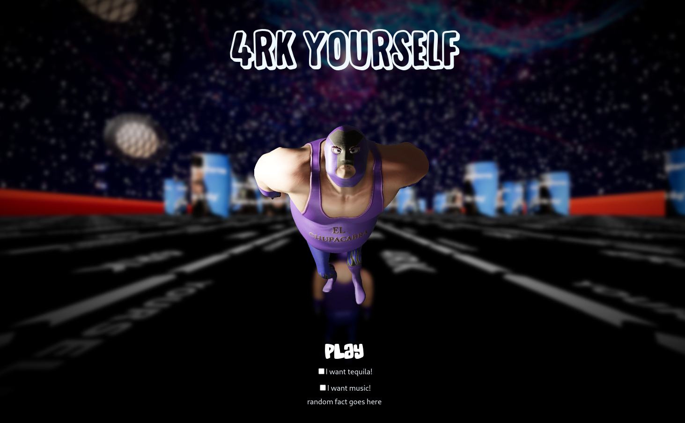

## INTRODUCTION

This is a simple three.js game with main focus of showing different parts of how does React work together with 3D graphics in three.js. Written in JavaScript + TypeScript. Consider this document as a humble help guide for beginners made by a one.

Want to test it? You can do it here: https://ogame-2aavl.ondigitalocean.app

Please note, it is configured with many extra post processing effects and may be sluggish on some machines.

---

## PACKAGES USED

`dependencies:`

- react-three/drei
- react-three/fiber
- react-three/postprocessing
- three
- zustand

`devPendencies:`

- gltfjsx
- simple-zustand-devtools

---

## 1 SOME THEORY

### 1.1 MAIN COMPONENTS

`Canvas` - The HTML `<canvas>` element is used to draw graphics, on the fly, via JavaScript. The `<canvas>` element is only a container for graphics. You must use JavaScript to actually draw the graphics.

`Scene` - is the environment that we set up using different objects. It is similar to the concept of a scene in a movie and it spans in three dimensions as we render it in our website using camera.

`Camera` - is used to determine which view of scene to render/ display. We can choose between different types of camera and varying lenses.

`Renderer` - The renderer uses the scene and camera to render.

---

### 1.2 CAMERAS

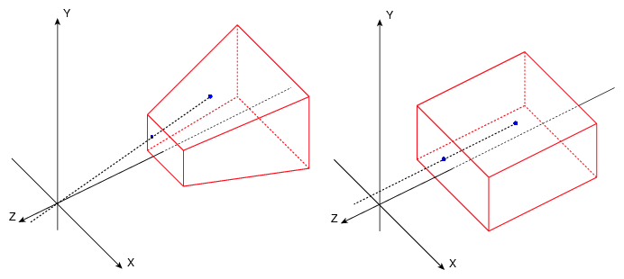

#### 1.2.1 Perspective camera

[three.js documentation link](https://threejs.org/docs/#api/en/cameras/PerspectiveCamera)
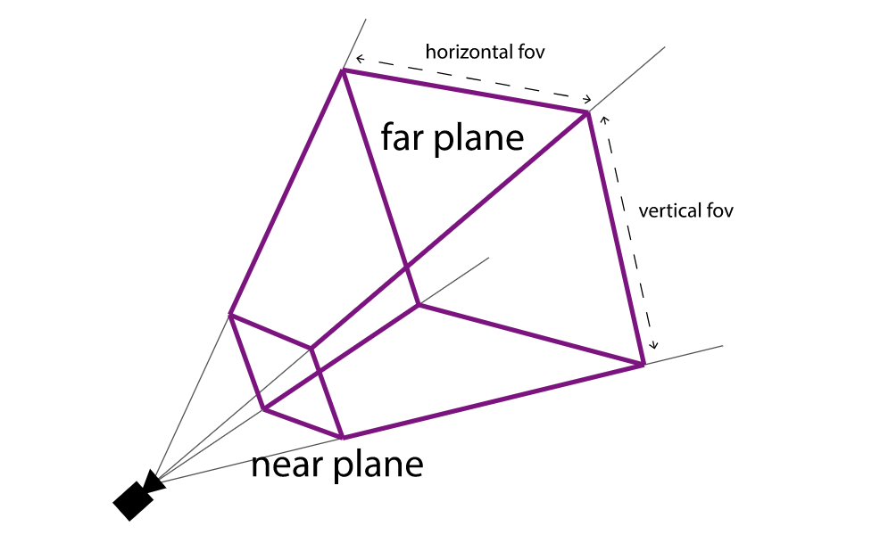

The simulation effect of perspective camera is the closest to the scene seen by the human eye, and it is also widely used in 3D scenes.Objects of the same size close to the camera appear large on the screen, and objects far from the camera appear small on the screen.

Building perspective camera takes these parameters:

`PerspectiveCamera( fov : Number, aspect : Number, near : Number, far : Number )`

- FOV — camera cone vertical field of view angle
- Aspect – Camera cone aspect ratio
- Near – near end face of camera cone
- Far far far end face of camera cone

#### 1.2.2 Orthographic camera

[three.js documentation link](https://threejs.org/docs/#api/en/cameras/OrthographicCamera)


When using an orthographic camera, the size of the object remains the same in the final rendered image regardless of whether the object is far or near the camera. The viewing cone of the orthographic camera is shown on the right side of the figure above.

Building orthographic camera takes these parameters:

`OrthographicCamera( left : Number, right : Number, top : Number, bottom : Number, near : Number, far : Number )`

- Left – left side of camera cone
- Right – right side of camera cone
- Top – upper side of camera cone
- Bottom – lower side of camera cone
- Near – near end face of camera cone
- Far far far end face of camera cone

---

### 1.3 COORDINATES SYSTEM

Coordinate system is needed to put things into places. Three.js uses the right-hand coordinate system, which is derived from the OpenGL default, which is also the right-hand coordinate system. Please note that z is used for depth.

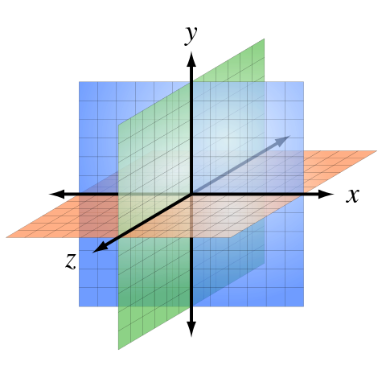

---

### 1.4 GEOMETRY

Geometry in computers is composed of points. Two points connects to a line, three (if not on the same line) can form a triangular face. Many triangular faces forms geometry of various shapes.

For example, to create a simple cube, you need to add 8 points(vertices) and 12 triangular faces.

---

### 1.5 MATERIAL

When creating geometry, the shape of the geometry is determined by specifying the vertex of the geometry and the face of the triangle. In addition, you need to add skin to the geometry to achieve the effect of the object. The material is like the skin for the object, which determines the texture of the object.

Default materials types in three.js are:

- Base material: a material that draws geometry in a simple shading way, unaffected by light.

- Depth material: the material that draws geometry by depth. The depth is based on the far and near end faces of the camera. The closer you are to the near end face, the whiter and the darker you are to the far end face.
- Normal vector material: a material that maps a normal vector to an RGB color.
- Lambert material: it is a kind of material that needs light source. It is a material with non glossy surface and no specular highlights. It is suitable for objects with rough surface.
- Phong material: it is also a material that needs light source. It has a shiny surface with specular highlights. It is suitable for reflective objects such as metal and paint.

- Material capture: uses maps that store information such as light and reflection, and then samples in the normal direction. The advantage is that it can achieve many special style effects with low consumption; the disadvantage is that it is better only for fixed camera perspective.

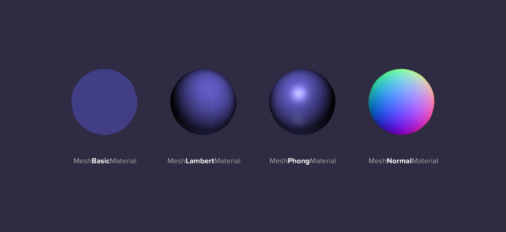

---

### 1.6 LIGHT SOURCE

The scene and materials utilize light sources to render 3D effects. If not added lightning effect cannot be produced.

#### 1.6.1 POINT LIGHT

Point light source does not have a base. You may imagine it as lightbulb that emits light in all directions and is suspended in air.
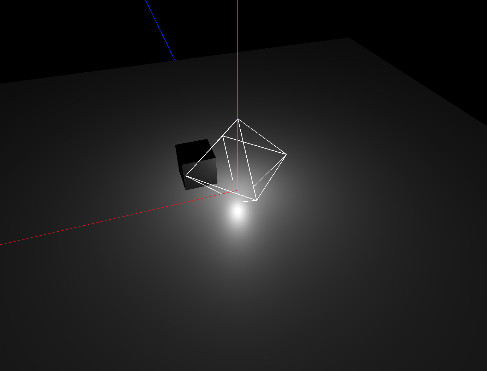

#### 1.6.2 DIRECTIONAL LIGHT

The parallel light simulates the sunlight. All the light emitted by the light source is parallel to each other.The whole area illuminated by the parallel light receives the same light intensity.


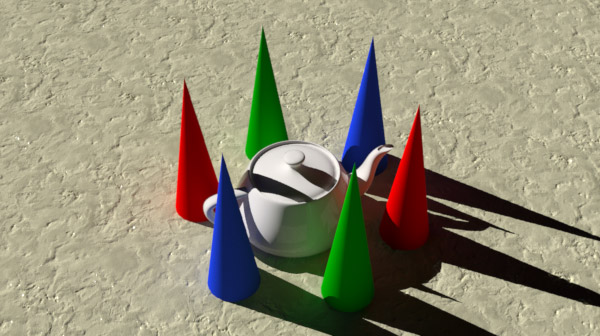

#### 1.6.3 SPOT LIGHT

Like a point light, a spot light has a specified location and range over which the light falls off. However, the spot light is constrained to an angle, resulting in a cone-shaped region of illumination. The center of the cone points in the forward direction of the light object. Light also diminishes at the edges of the spot light’s cone. Widening the angle increases the width of the cone and with it increases the size of this fade, known as the ‘penumbra’.


#### 1.6.4 AMBIENT LIGHT

The ambient light is the light that comes from multiple reflections. The light emitted by the ambient light source is considered to come from any direction.It will show the same level of light and shade.

No ambient light

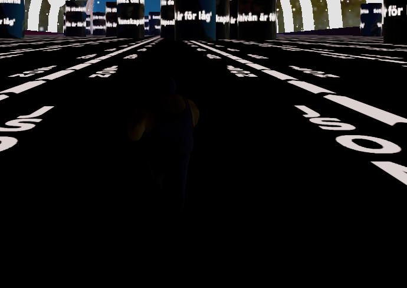

With ambient light

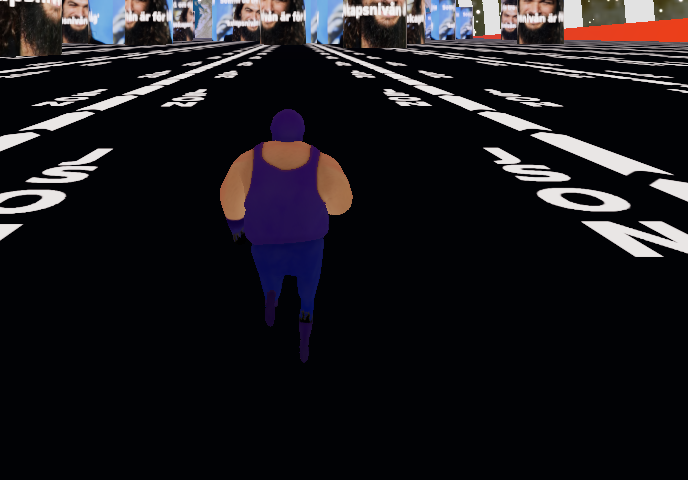

---

### 1.7 TEXTURES

In life many objects exist with uneven lines or patterns. To achieve the effect of these objects with three.js, texture mapping is needed. Adding texture to the material and mapping it to geometry with certain rules, makes it look more close to real world case.

#### 1.7.1 Mapping texture

Earth texture mapping to a sphere


#### 1.7.2 Panoramic mapping with reverse map

This example is a panoramic view made by texture mapping on the opposite side of the spherical geometry (If the earth example has mapping on the sphere, here the same thing could be applied inside the sphere).


#### 1.7.3 Mapping texture depth

Depth mapping uses black and white values to map to the perception depth related to the light, which does not affect the geometry of the object, only affects the light, and is used for light-sensitive materials (Lambert and Phong materials).


#### 1.7.4 Normal texture light mapping / UV mapping

This is used to achieve the uneven visual effect by affecting the light, but not the geometry of the object. May be used for light-sensitive materials (Lambert and Phong materials). The RGB value of the normal texture image in the lower left corner of the image above affects the surface normal of each pixel segment, thus changing the lighting effect of the object.

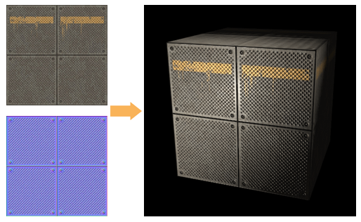

#### 1.7.5 Environmental map

Environment mapping is when we map the environment as a texture, which can simulate the reflective effect of the mirror.


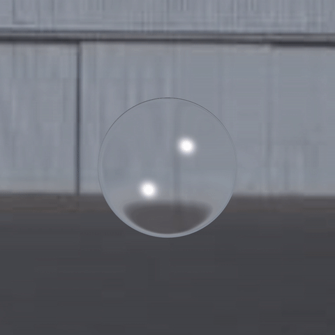

---

### 1.8 LOADING MODELS

Three.js has built in a lot of commonly used geometry, such as sphere, cube, cylinder, and so on. In real world use, it is often required to use some special geometry with complicated shapes. At this time, 3D modeling software can be used to make 3D model, export files in obj, JSON, gltf, glb or other formats, and then load them into three.js to render.

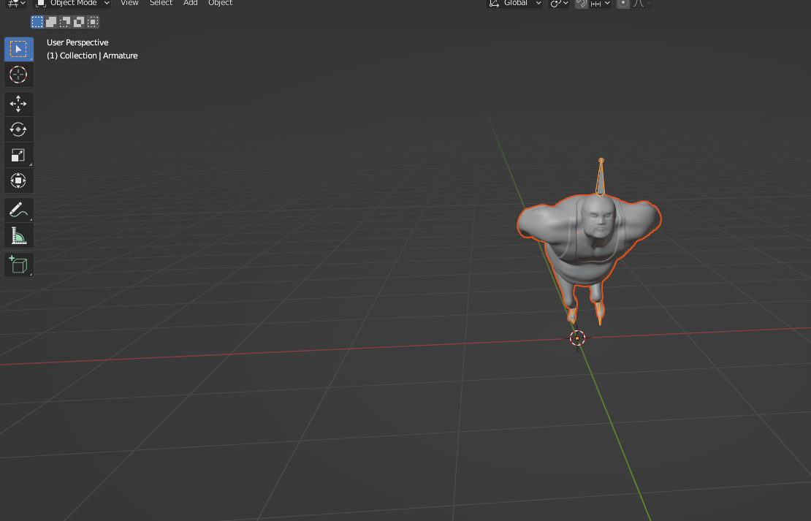

---

## 2 BUILDING EXPLANATIONS

Here I want to make note that this guide's result may differ from the actual code in the repository, and is here to show and explain the **essentials**. Furthermore I want to add, that I will not go step by step, but rather point out trickiest moments. This also means that you as a reader should be already familiar with code in this repository.

### 2.1 STORE

In the beginning of this project redux was my designated state manager but it appears that react in its design when forwarding to canvas manages to lose[^2] the context. I didn't want to apply any workarounds (or React Context) and therefore just used another state manager. That's how I discovered zustand (alternative: recoil).

Down below you shall find direct links to the store and its types for TypeScript in this repository. Because of it's fantastic features, often it gets self explanatory what contains what. The only difference here that in the same store file I've created object called `data` which is not to be confused with the store itself. This is just a simple object stored in this file for convenience.

> [link to my store](./src/zustand/zStore.tsx)

> [link to my types for store](./src/zustand/type.d.ts)

TLDR - ` REDUX REACT AND CANVAS BIG NO NO . Must use Context or Zustand in this case. alt. zustand, recoil, context`

[zustand docs](https://github.com/pmndrs/zustand)

[^2]: `TypeError: Cannot set properties of undefined (setting 'hook') @ at onCommitRoot. -Hooks can only be used inside the Canvas element because they rely on context!`

---

### 2.2 MAIN APP COMPONENT

Due to the fact that main focus of this project was React and three.js one of the goals was to utilize react's components to their fullest. Therefore main App component will have all the other used components just listed inside of it instead of further branching.

#### 2.2.1 CONCURRENT MODE, DREI PRELOAD

I am heavily utilizing experimental `Concurrent` mode, more info about it [here](https://reactjs.org/docs/concurrent-mode-intro.html)

`Concurrent` and `Suspense`? What is that?

To put it in simple terms `Concurrent` mode is a new way to fetch data using `Suspense` component. In my case when we are loading a big chunk of data, instead of creating another state for loader we are using React's beta fallback method. `Suspense` component does take `fallback` argument which could be null or our custom **Component** that exchanges the view until it is fully loaded. Please refer to the line below for an example:

```
<Suspense fallback={<CustomComponent} />
```

Of course it is more complicated than that, but for this project that is "good to go" explanation without diving deep into interruptible rendering.

What's `Preload` - component from react-three-drei package ?

```
<Preload all>
```

The WebGLRenderer will compile materials only when they hit the frustrum, which can cause jank. This component precompiles the scene using gl.compile which makes sure that your app is responsive from the get go.

> [link to main App.tsx component](./src/App.tsx);

> Justice's practical notes:

> - Switch React to @experimental and flag the canvas as concurrent. Now React will schedule and defer expensive operations. You don't need to do anything else, but you can play around with the experimental scheduler and see if marking ops with a lesser priority makes a difference.
> - Don't put Suspense inside Suspense

#### 2.2.2 CANVAS AND OVERLAY

Since three.js when working together with canvas and react makes it really hard to produce any text in a simple manner, a HTML overlay in most cases is more than sufficient . That is why you can see that all text manipulation is done in the default for a web developer way.

```
<><Canvas>three.js stuff</Canvas><MyHTML></MyHTML></>
```

#### 2.2.3 MAIN LIGHTS

For general visibility, and just to make things brighter I've used ambientLight with `0.1` intensity and simulated sun-like light with directional light, that was centered and lifted a bit on y-axis, and pushed on z.

#### 2.2.4 CAMERA SHAKE FROM DREI

Well the name gives it away itself! Below you can find configuration props for it.

```javascript
const config = {
  maxYaw: 0.1, // Max amount camera can yaw in either direction
  maxPitch: 0.1, // Max amount camera can pitch in either direction
  maxRoll: 0.1, // Max amount camera can roll in either direction
  yawFrequency: 1, // Frequency of the the yaw rotation
  pitchFrequency: 1, // Frequency of the pitch rotation
  rollFrequency: 1, // Frequency of the roll rotation
  intensity: 1, // initial intensity of the shake
  decay: false, // should the intensity decay over time
  decayRate: 0.65, // if decay = true this is the rate at which intensity will reduce at
  additive: false, // this should be used when your scene has orbit controls
};

<CameraShake {...config} />;
```

---

### 2.3 IMPORTING MODELS

Because my modelling skills are worse than the worst I've used some help of the amazing 3D library of [Mixamo](https://www.mixamo.com). Over there I've found my main character and all the animations I need. With the help of [Blender](https://www.blender.org) I've combined all the animations into single `.glb` (binary) file.

The importing itself is pretty straight forward. I've just used react-three-drei hook `useGLTF` and pointed directly to the binary itself (note! use whatever is supported and just don't think too much about it).

[drei useGLTF hook](https://github.com/pmndrs/drei#usegltf)

> Justice's practical notes:

> - When importing / exporting in blender, tick x/y bone orientation field
> - To avoid degrading site’s performance with the size 3D asset, compress it before loading it into scene. It’s recommended that file size not exceeds 1 to 2 megabytes. Use glTF pipeline compression extension called Draco:
>   `gltf-pipeline -i <source file> -o <output file> --draco.compressionLevel=10`

---

### 2.4 USING MODELS

When importing a model with a hook, it is smart to exercise the best of JavaScript-React and just destructure directly ito objects that we are going to use. In our case for 3D manipulations this hook will provide us with `nodes, materials` and `animations`. Please note that my model does utilize all the materials within the model itself. It is definitely possible to "materialize" your model programmatically as well. To make things easier I am making some assumptions for clarity's sake:

- `nodes` shall be used as `geometry`
- `materials` as a `material`
- `animations` shall be used as one of the parameters for [useAnimations](https://github.com/pmndrs/drei#useanimations) hook where we get an object that is just a call away from animating our model.

When we are done with imports, this is the place where if using `TypeScript` it could be very fruitful to create types for your models/But because every model is different we can't expect the car model to have hands or something between those lines. Therefore this part is completely dependent on you and your dedication. In my case because time was against me and laziness didn't help I've just used `any` type. Please refer to the example below.

> Link to my imported model [Pedro.tsx](./src/c/Pedro.tsx)

```javascript
<group rotation={[Math.PI / 2, 0, 0]} scale={0.01}>
          <primitive object={nodes.mixamorigHips} />
          <skinnedMesh
            geometry={nodes.Ch43.geometry}
            material={materials.Ch43_Body}
            skeleton={(nodes as any).Ch43.skeleton}
          />
        </group>
```

> Justice's practical tips:
>
> use `gltfjsx` tool to export JavaScript file with all the meshed materials and so on from `glb` model. That way you will skip the manual labor.
> The GLTF file has to be present in your projects `/public` folder
>
> How to here: [docs](https://github.com/pmndrs/gltfjsx)

---

### 2.5 MAIN GAME DYNAMICS

Here you shall find quick overview of the most crucial parts of the moving parts in the game.

#### 2.5.1 PLAYER'S SPEED

Let's begin with our runner - I've named him Pedro. In this game he moves always forward at any given time. His speed is defined with a function `Math.sqrt(data.gameSpeed * delta * GAME_SPEED_BASE`. The only unknown variable for you is the `delta`. To make things simple I just might say that this variable ties our game changes to the framerate. Square root was basically used as an equalizer for increasing player's speed, but not as rapidly and simple as multiplication. Please refer to the `sqrt(x)` graph from Google below:

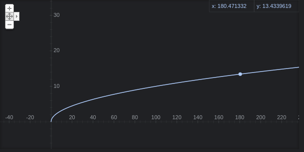;

Now compare it to simple `x` graph in case of just simple multiplication.

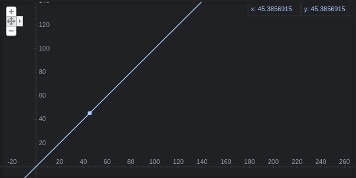

As you might see the first one provides much more careful increase in speed, therefore player may last longer and still feel increasing pace. So what we essentially do here is just describe the speed in which our model shall be pushed towards on our chosen axis. Three.js then simply move our model on that axis and with added animation - thus creating illusion of running.

#### 2.5.2 TURNING LEFT AND RIGHT

The turning mechanics use zustand store to store if the button is being pushed and then if needed mutates exported data object. This happens every single frame, so approximately 60 times a second. Now lets explore how exactly it happens.

The `data.xy` object describes how fast our running model's turn rate is. It has one parameter - number. 0 means we are perfectly centered and run straight forward to our decided axis and now as you guessed `+/- number`is another way to tell of which side we are turning to. I agree that `xy` maybe is not the correct name for it but I'm just too lazy to make changes now. Now let's get trough main part of how that rate is mutated every single frame. First we create `new_delta` that is tied to our real `delta` where we decide how great our new correctional value will be. THIS `data.xy` mutation is the key value that decides how quick of change we can do in every frame. That does dictate how fast can we turn our character and how fast it goes back to initial `0` aka straight. Please refer to the discussed code below:

```javascript
const new_delta = delta * CORRECTIONAL_DELTA;

data.xy = Math.min(0.2, data.xy - new_delta);
```

A piece of code in action when user is turning left

```javascript
if (left && !right) {
  data.xy = Math.min(0.2, data.xy - new_delta);
  pedro.current.rotation.y = limitTurningAngle(
    pedro.current.rotation.y - (data.xy * OBJECT_TURN_RATE) / 100
  );
}
```

[link to Pedro.jsx](./src/c/Pedro.tsx);

#### 2.5.3 NEVER ENDING TERRAIN

The never ending terrain's (It is flat but still terrain) secret lies in how three.js draws/shows stuff. That's what we are banking on. In reality there are two pieces of terrain that hop over ech other and with clever camera positioning we never see what happens behind us. Exactly how this works you may see in picture below:

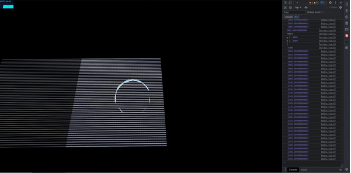

But what about code? Well the idea is simple, we just calculate when it is time to do the change/hop. When we start the application we start with a reference which is equal to `1`, this is our current terrain counter. Then we add reference to previous/last terrain counter as well, but in this case since we had nothing before it it just stays as `0`. Then all we need to do is to keep track where our model is on `z-axis`. Now it is just a question of when we want to do the change which looks something like this:

`IF pedro.current.position.z + TERRAIN_SIZE * TerrainCounter - our_change_will take place here(10 in my case)> our_change_will take place here(-10 in my case)`

If you wondering why the hell we have 10 there, it is because we need to change at `-10z` position so that user wouldn't see changes. Please note that my model is always moving towards negative side of z axis! Finally when we are in the right spot we do the change/hop:

```javascript
terrainCounter.current % 2 === 0
  ? setTerrainIntoNewPosition(g_two)
  : setTerrainIntoNewPosition(g_one);
terrainCounter.current++;
```

From the code you may see that I change terrain positions every 2nd increment.

[link to Terrain.jsx](./src/c/Terrain.tsx)

#### 2.5.4 NEVER ENDING OBSTACLES

First of all Im putting heavy calculations into [useMemo](https://www.w3schools.com/react/react_usememo.asp) hook, because there is no need to run them when it is unnecessary. The the only thing I do here is generate random coordinates for my obstacles with some rotation variations. Down below you can find an easy self explaining code:

```javascript
const obstacle_coords_bank = [];
for (let index = 0; index < OBSTACLES_QT; index++) {
  // putting obstacles CLOSE to walls
  const x = randomWithinRange(
    LEFT_WALL + WALL_RADIUS / 2,
    RIGHT_WALL - WALL_RADIUS / 2
  );
  const y = 0;
  const z = -FREE_REAL_ESTATE + randomWithinRange(-400, 400); //steps between obstacle nests is called FREE REAL ESTATE

  const rotate = randomWithinRange(-2.6, 2.6);

  obstacle_coords_bank.push({ x, y, z, rotate });
}
```

The more interesting thing I've discovered here is that later on when we set these obstacles we need to use some helpers. Here it is in a `forEach` loop:

- `obstacle3D.position.set(o.x, o.y, o.z);` setting obstacle in its position

- `obstacle3D.rotation.y = o.rotate;` - setting its rotation

- `obstacle3D.updateMatrix();` - [docs three.js](https://threejs.org/docs/#api/en/core/Object3D.updateMatrix)

- `obstacle_ref.current.setMatrixAt(i, obstacle3D.matrix);`

AND NOW FINALLY OUT OF THE LOOP

` obstacle_ref.current.instanceMatrix.needsUpdate = true;` [three.js docs](https://threejs.org/docs/#manual/en/introduction/Matrix-transformations). It just doesn't work without it.

> Justice's practical tips:
>
> This little piece of code makes obstacles grow, instead of just appearing out of nowhere.
>
> ```javascript
> if (o.y < OBSTACLES_HEIGHT / 2) {
>   o.y + delta * 100 > OBSTACLES_HEIGHT / 2
>     ? (o.y = OBSTACLES_HEIGHT / 2)
>     : (o.y += delta * 100);
> }
> ```

#### 2.5.5 COLLISION DETECTION

In the beginning this seemed like a scary idea, but now I can see that it all comes to middle school math problem. To "detect" collision we just calculate the distance between our model position (x,z) and the obstacle (x,z). Please note that here we do calculation only in 2 dimensions because our model moves only to the sides `x-axis` and forwards `z-axis`. First inside our `forEach` loop we check if we are closing to our obstacle on our `z-axis`:

```javascript
if (o.z - pedro.current.position.z > -15)
```

then we do the same thing on `x-axis`, but on both `- and + sides`

```javascript
 if (
          o.x - pedro.current.position.x > -15 ||
          o.x - pedro.current.position.x < 15
        )
```

finally if we see that we are **pretty close** and ONLY THEN we go deeper into the rabbit's hole with more expensive calculation.

```javascript
if (distance_to_pedro < 11) {
  gameOver(true);
}
```

where

```javascript
distance_to_pedro = getDistance(
  model_position.x,
  model_position.z,
  obstacle.x,
  obstacle.z
);
```

Instead of showing `getDistance` function I'll just provide you with the most famous math formula which will tell the whole story:

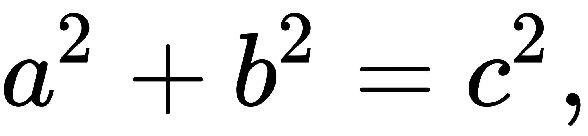

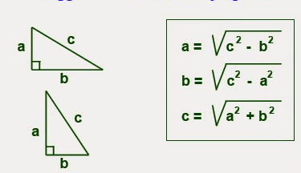

[link to code obstacles.tsx](./src/c/Obstacles.tsx);

### 2.6 CONTROLS

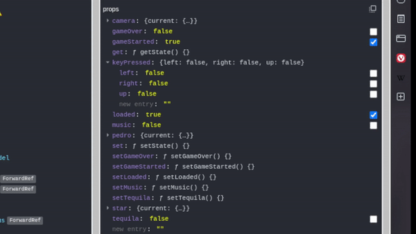

Controls are made out of 3 main components. The first one is the `state store` where we put/get the final result - we can see if our button is being pushed or not. The best part about is that the button will stay in pushed state until you release it.
The second part is the `<Controls/>` component itself. There I import my designated control buttons as an array which looks like this:

```javascript
CONTROL_LEFT = ["ArrowLeft", "a", "A"];
```

As you may see adding any other button for that specific action is a piece of cake. Then I utilize my custom React hook with a little twist. I send whole dispatch action down the pipe with all the structure of `{keyPressed}` object I need into the hook:

```javascript
 useKey(CONTROL_LEFT, (bool: boolean) =>
    dispatch((state: any) => ({
      ...state,
      keyPressed: { ...state.keyPressed, left: bool },
    }))
```

Here we finally come the hook itself. Thanks to TS we can see that my hook does require a `string || array of strings` and `stateDispatch` action. We start with adding event listeners on `keyup` and `keydown`
with some extra options[^1]. Please refer to the example below:

```javascript
window.addEventListener("keydown", _onKeyDown, { passive: true });
```

First we initiate an empty array to store our pressed buttons and now here is where we `useEffect` of our keydown event. With the help of TS we know that we should be expecting of a keyboard event, where we are checking if our designated button is being pushed with `button.indexOf(e.key) > -1` line. Then if a match is in place we cast that button as a boolean value `buttonName: true` into our array which makes sure that it is saved until further changes. Now we finally dispatch to our store:

```javascript
const _onKeyDown = (e: KeyboardEvent) => {
  if (button.indexOf(e.key) > -1) {
    const isHeld = !!pressed[e.code]; //cast as boolean
    pressed[e.code] = true;
    if (!isHeld) stateDispatch(true);
  }
};
```

Now we can unmount our listeners in `useEffect` hook.

[^1]: A boolean value that, if true, indicates that the function specified by listener will never call preventDefault(). If a passive listener does call preventDefault(), the user agent will do nothing other than generate a console warning. See Improving scrolling performance with passive listeners to learn more. [read more here](https://developer.mozilla.org/en-US/docs/Web/API/EventTarget/addEventListener)

### 2.8 SOUNDS

Three.js does come with amazing tools for your audio. To begin we need to import some audio files and then load some three.js helpers `AudioListener, AudioLoader` and maybe even `AudioAnalyser` if you're feeling adventurous! Then we may put files into `react-three-drei` loader (Same rules apply for `AudioAnalyser`):

```javascript
const ourTrack = useLoader(AudioLoader, our_imported_audio);
```

and this is where we are ready to abuse `React` hooks such as `useEffect` and put some rules into audio player:

```javascript
music_player.current.setBuffer(ourTrack);
music_player.current.setLoop(true);
music_player.current.setVolume(1);
music_player.current.setPlaybackRate(1);
music_player.current.play();
```

where `music_player` is just a reference inside `audio` tag:

```javascript
const [listener] = useState(() => new AudioListener());

<audio ref={music_player} args={[listener]} />;
```

> Justice's practical tips:
>
> - Use `AudioAnalyser` for neat tricks with frequencies and maybe build your own equalizer or even sound sensitive graphics!
> - WHEN TS COMPLAINS about mp3 as import use this type:
>
> ```
> declare module '*.mp3' {
> const src: string;
> export default src;
> }
> ```

### 3 TEXTURING AND COLORS

For examining purposes [Obstacles.jsx](./src/c/Obstacles.tsx) may be also used as an example, but if you want less distractions please just follow the text below.

#### 3.1 APPLYING TEXTURE, MAPPING, COLORS

For your pleasure here you can find an example code of how texturing works - the very basics. Sometimes code says more than any description. Please note that this code is not utilized in the project. You can find ready to use template [here](./readme_files/examples/texture_mapping)

```javascript
import { OrbitControls, useTexture } from "@react-three/drei";
import { Canvas } from "@react-three/fiber";
import { Suspense } from "react";
import three from "three";

const name = (type: string, ext: string = "jpg") => `${type}.${ext}`;

const Scene = () => {
  const [colorMap, ambientOcclusionMap, displacementMap, roughMap, normalMap] =
    useTexture([
      name("Color"),
      name("ambientOcclusion"),
      name("Displacement"),
      name("Roughness"),
      name("Normal"),
    ]);

  return (
    <>
      <mesh>
        <ambientLight intensity={0.2} />
        <directionalLight />
        <sphereBufferGeometry args={[1, 100, 100]} />
        <meshStandardMaterial
          displacementScale={0.2}
          map={colorMap}
          displacementMap={displacementMap}
          roughnessMap={roughMap}
          normalMap={normalMap}
          aoMap={ambientOcclusionMap}
          emissiveMap={ambientOcclusionMap}
          emissiveIntensity={0.1}
          emissive={new three.Color(0xff0000)}
        />
      </mesh>
    </>
  );
};

export default function App() {
  return (
    <div className="App">
      <Canvas>
        <Suspense fallback={null}>
          <Scene />
          <OrbitControls autoRotate />
        </Suspense>
      </Canvas>
    </div>
  );
}
```

[three.js docs - MeshStandardMaterial](https://threejs.org/docs/#api/en/materials/MeshStandardMaterial)

There are times when our objects might be massive and we just cant stretch single texture over it. Therefore we can just repeat it. To do that just put in work `useLayoutEffect` hook. This is how we can get more control and wrap our textures the way we want it. Note that it is not necessary in my case but Im putting it here for anyone who wants to play around.

```javascript
texture.wrapS = texture.wrapT = RepeatWrapping;
texture.repeat.set(1, 1);
texture.anisotropy = 16;
```

**Anisotropy** - The number of samples taken along the axis through the pixel that has the highest density of texels. By default, this value is 1. A higher value gives a less blurry result than a basic mipmap, at the cost of more texture samples being used.

### 4 DRAFT TEXT

- PI is for rotation 3.14 is magic 360 or you can use radians

- don't like people? `pointer-events: none`

[GO TO THE BEGINNING](#INTRODUCTION)
